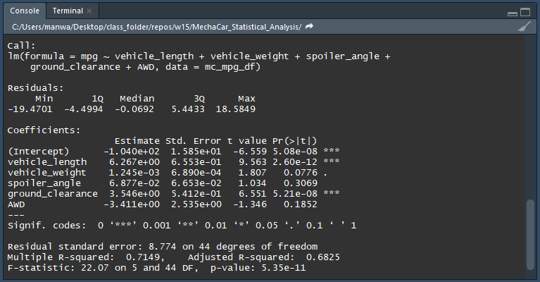
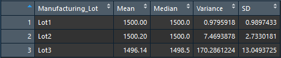
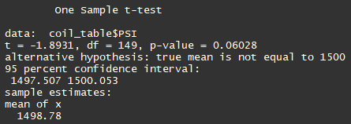
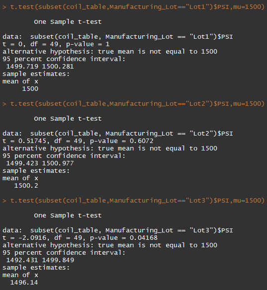

# MechaCar_Statistical_Analysis
## Linear Regression to Predict MPG
  
### Summary
 - The variables/coefficients that seem to contribute the most non-random variance are, in order from most non-random variance to least non-random variance are: vehicle_length, ground_clearance, and vehicle_weight; although the vehicle_weight it just outside of normal significance with a p-value of 0.0776.  
 - The slope of the linear model is not zero. The 'Multiple R-squared" is 0.7149, meaning that there are some variables that contribute slope to our linear regression.
 - The linear model does show a corelation between the vehicle_length and ground_clearance and the mpg of a vehicle. These findings could be used when designing future MechaCars, or be used to try and anticipate a projected mpg.
## Summary Statistics on Suspension Coils
  
  
### Summary
If looking at the total summary that includes all lots, the suspension coils do not exceed the variance off 100 pounds per square inch. Although, when looking at each lot individually, Lot 3 appears to be producing the vast majority of the inconsistencies. Lot 1 (.98 Variance) and Lot 2 (7.47 Variance) are within the variance limits, while Lot 3 (170.29 Variance) is not.
## T-Tests on Suspension Coils
  
  
### Summary
 - The overall mean for all three manufacturing lots is 1498.78, with a p-value of 0.06. When looking at the total overall values, we fall within the normal significance and therefore cannot reject the null hypothesis.
 - Lot 1 has a mean of 1500, and a p-value of 1. We cannot reject the null hypothesis, as Lot 1 has a mean that matches the population mean.
 - Lot 2 has a mean of 1500.2, and a p-value of 0.61. We cannot reject the null hypothesis, as Lot 2 has a mean that is very similar to the population mean.
 - Lot 3 has a mean of 1496.14, and a p-value of 0.042. Since 0.042 is lower than normal significance, we will reject the null hypothesis. These results are statistically significant.  
When looking at p-values for the overall values, the variances are not statistically significant. Although, when we look the the individual p-values, we can see that Lot 3 is statistically significant. I think that this shows how important it can be to drill down numbers into subcategories, when it will not become too cumbersom. The company could check in on Lot 3 to identify why their product is not being produced more consistently, and hopefully resolve the issue.
